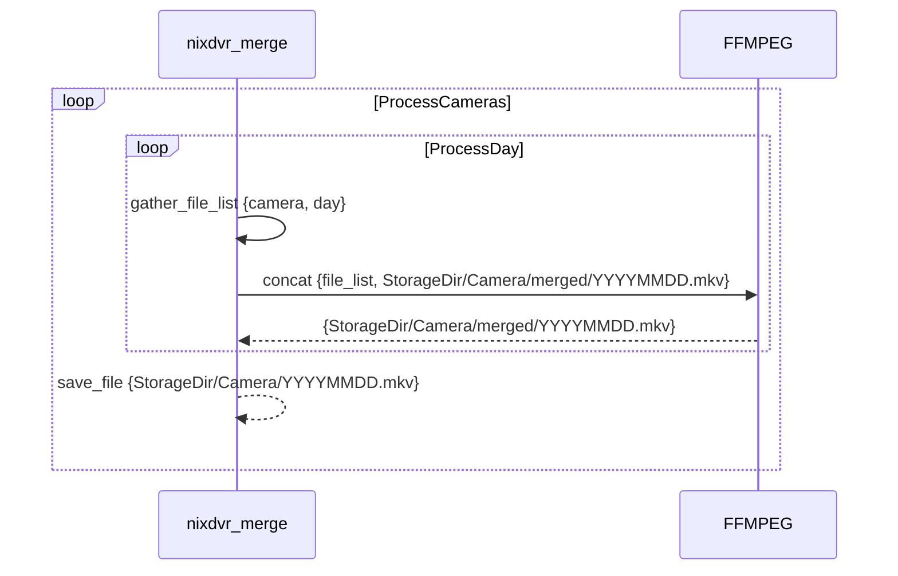
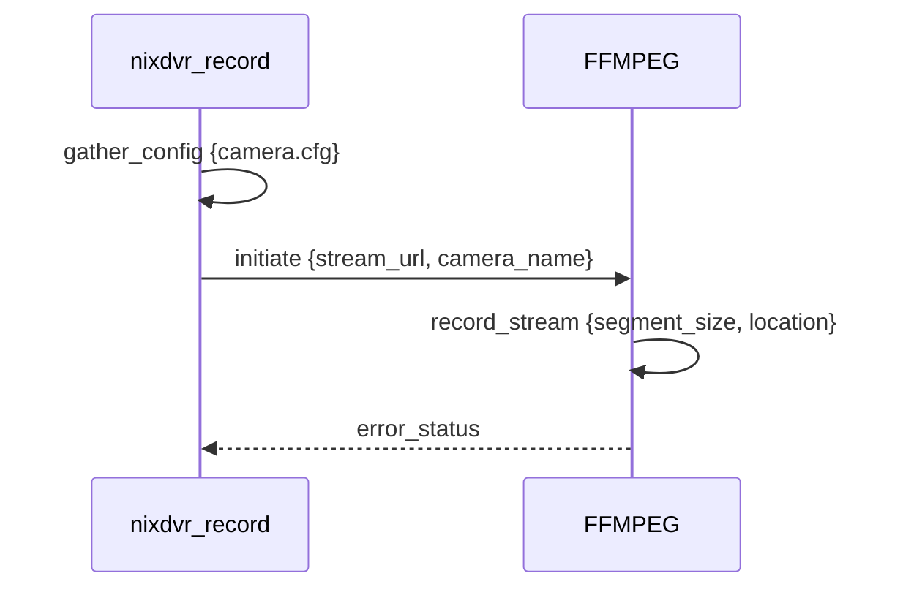

# Cleanup

# Merge

## Sequence

```mermaid
sequenceDiagram
    loop ProcessCameras
        loop ProcessDay
            nixdvr_merge->>nixdvr_merge: gather_file_list {camera, day}
            nixdvr_merge->>FFMPEG: concat {file_list, StorageDir/Camera/merged/YYYYMMDD.mkv}
            FFMPEG-->>nixdvr_merge: {StorageDir/Camera/merged/YYYYMMDD.mkv}
        end
        nixdvr_merge-->>nixdvr_merge: save_file {StorageDir/Camera/YYYYMMDD.mkv}
    end
```

# Record

## Sequence

```mermaid
sequenceDiagram
    nixdvr_record->>nixdvr_record: gather_config {camera.cfg}
    nixdvr_record->>FFMPEG: initiate {stream_url, camera_name}
    FFMPEG->>FFMPEG: record_stream {segment_size, location}
    FFMPEG-->>nixdvr_record: error_status
```

